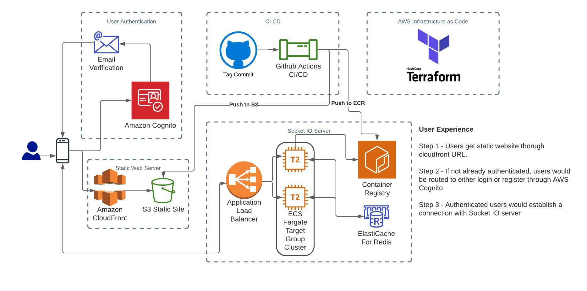
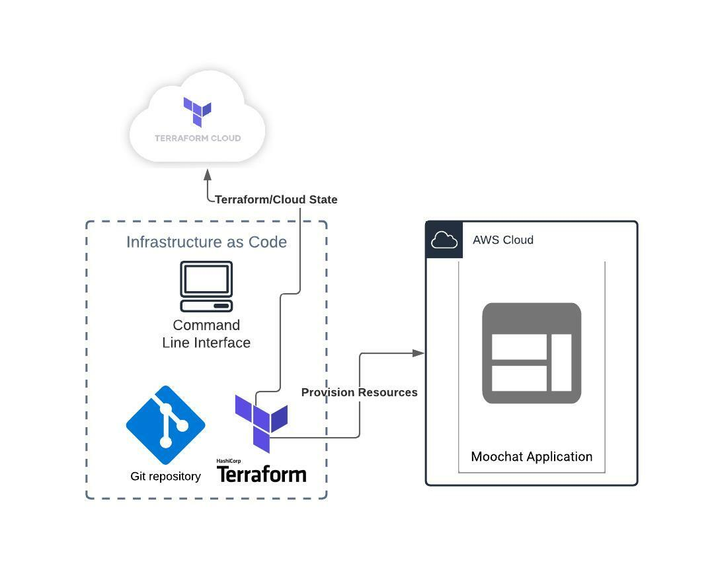

# moo-chat-infrastructure
- Additional Repos: [UI](https://github.com/runntimeterror/moo-chat), [Socket Server](https://github.com/runntimeterror/moo-chat-socket-server)
- University Project for www.sjsu.edu.
- Course: [Cloud Technology](http://info.sjsu.edu/web-dbgen/catalog/courses/CMPE281.html)
- Professor: [Sanjay Garje](https://www.linkedin.com/in/sanjaygarje/)


Students:
- [Soham Bhattacharjee](mailto:soham.bhattacharjee@sjsu.edu)
- [Gabriel Chen](mailto:gabriel.chen@sjsu.edu)
- [Rajat Banerjee](mailto:rajat.banerjee@sjsu.edu)
- [Rohan Patel](mailto:rohan.patel@sjsu.edu)

## Architecture Diagram


### Deployment Pipeline CI/CD
- [Socket Server CI/CD](https://github.com/runntimeterror/moo-chat-socket-server/blob/main/.github/workflows/socket_server.yml)
-   Socket server is deployed as a Docker container that runs on AWS Fargate. New semver tags triggers builds, and uploads builds to AWS ECR, then triggers AWS ECS to update and pull the new build from ECR.
- [UI](https://github.com/runntimeterror/moo-chat/blob/master/.github/workflows/react_app.yml)

### High Availability
- AWS Fargate is configured to scale according to the number of concurrent transactions to scale the socket server as more users come online.
- AWS ECS configured to always keep 1 healthy instance running as upgrades are made to the service.
- AWS S3, hosting the static front end UI, has multi-AZ configuration to ensure high availability for origin requests.
- AWS Cloudfront is used as a distributed cache for the front end to reduce origin requests.

## Infrastructure As Code


## Run
```
# Install Terraform
$ aws configure # access/secret key, region... alternatively utilize aws-vault
$ terraform login # requires terraform cloud account
$ terraform init -reconfigure # prevents migrating local state into cloud
$ terraform plan # check changes
$ terraform apply # provision aws resources
```
