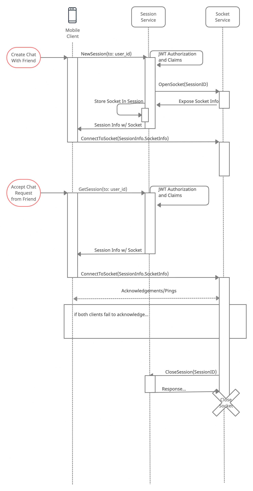

# 281-peer2peer-infrastructure

## Architecture Diagram


## Sequence Diagram


## Run
```
# Install Terraform
$ aws configure # access/secret key, region...
$ terraform login # requires terraform cloud account
$ terraform init -reconfigure # prevents migrating local state into cloud
$ terraform plan # check changes
$ terraform apply # provision aws resources
```
