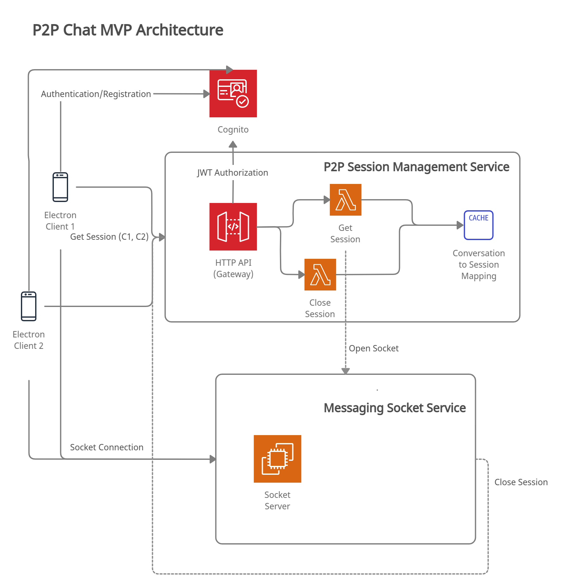

# 281-peer2peer-infrastructure

## Architecture Diagram


## Run
```
# Install Terraform
$ aws configure # access/secret key, region...
$ terraform workspace new [environment] # environments "dev" "prod"
$ terraform workspace select [environment]
$ terraform init
$ terraform plan # check changes
$ terraform apply #provision aws resources
```